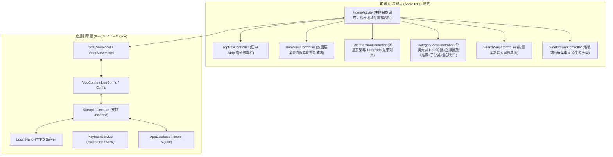

# Apple TVBox 项目工程交接与技术架构文档

> **版本**：`v1.0.54`  
> **基线 Commit**：`Release v1.0.54`  
> **分支**：`main`  
> **最后构建状态**：GitHub Actions CI 构建通过 (Release `v1.0.54`)  
> **代码仓库**：[liujiawei-zuopin/apple-tvbox](https://github.com/liujiawei-zuopin/apple-tvbox)  
> **本地工作区**：`c:\Users\liuji\Documents\antigravity\sharp-brahmagupta\apple-tvbox`

---

## 一、 项目整体概述与核心架构

本项目基于 **FongMi（蜂蜜）TV 核心引擎** 进行深度重构，实现了 **“底层数据/播放引擎与前端 Apple tvOS 交互界面的 100% 彻底解耦”**。

---

## 二、 前端 UI 组件划分与核心文件清单

前端 UI 逻辑全部解耦至独立控制器中，避免了以往所有逻辑堆叠在单一 Activity 导致的“改一处坏全局”问题：

| 组件名称 | 对应 Java 控制器 / 布局文件 | 职责与设计规范 (v1.0.54 升级) |
| :--- | :--- | :--- |
| **顶部胶囊导航** | `TopNavController.java` `TopNavAdapter.java` `bg_top_capsule_bar.xml` `bg_capsule_selected.xml` | • 完全屏幕水平居中，34dp 磨砂玻璃外槽 + 29dp 弹性缩放药丸。 • 固定 5 大入口：主页、电影、剧集、综艺、搜索 🔍。 • 纯白高亮药丸跟随焦点同步平移，杜绝双药丸 Bug。 |
| **Hero 全景海报与动态模糊** | `HeroViewController.java` `BlurUtil.java` `activity_home.xml` | • **双图层架构**：底层高清海报 + 顶层预生成 StackBlur 毛玻璃层。 • **第一屏海报区域极大化**：占据屏幕 70% 面积，极具视觉冲击力。 • **下滑动态毛玻璃化**：下滑离开第一屏时，海报平滑过渡为深色磨砂背景，简介文字视差淡出；滑回第一屏瞬间恢复清晰。 |
| **三大沉底货架与光学对齐** | `ShelfSectionController.java` `VodCardLandscapeAdapter.java` `VodCardPortraitAdapter.java` | • **卡片均分排布**：138dp × 78dp 黄金 16:9 卡片，首屏均分排布 6 张卡片无截断。 • **光学视觉对齐**：负外边距校准，卡片左圆角弧顶与标题文字垂直对齐。 • **D-Pad 确定性单步跳轴**：`现在观看 ⬇️ 继续观看 ⬇️ 正在热播 ⬆️ 顶栏胶囊`。 |
| **分类大屏频道页** | `CategoryViewController.java` `VodCardPortraitShelfAdapter.java` `layout_category_channel.xml` `bg_ambient_movie_emerald.xml` `bg_ambient_tv_sapphire.xml` `bg_ambient_variety_amethyst.xml` | • **专属暗色毛玻璃背景**：电影（深墨绿 `#072015`）、剧集（深宝蓝 `#081A3A`）、综艺（深紫晶 `#1E0B34`）。 • **顶部 Hero 轮播**：轮播近期热播剧，简介下方包含 Apple tvOS 纯白高光「▶ 立即播放」按钮。 • **推荐货架 (16:9)**：138x78dp 横版卡片（不联动上方 Hero）。 • **子分类货架 (2:3)**：精选主流子分类横向货架。 • **全部影片 (5 列大网格)**：多维分类芯片筛选 + 5 列瀑布流全量影片。 |
| **大屏内置搜索** | `SearchViewController.java` `layout_home_search.xml` `shape_search_bar.xml` | • 顶栏直接切换搜索页，内置虚拟键盘、热搜榜单、历史记录与语音输入。 • 按键上下平滑与顶栏联动。 |
| **毛玻璃抽屉** | `SideDrawerController.java` `layout_side_drawer.xml` | • 左侧呼出式深色磨砂面板，按遥控器 [菜单键] 或在首张卡片按 `⬅️` 滑出。 • 顶部展示时钟，包含 9 项快捷菜单与当前站点原始原生分类网格。 |

---

## 三、 内置高保真离线演示测试源机制

为彻底摆脱外部服务器不稳定或第三方源失效对开发测试的干扰，工程内置了离线高保真演示数据源：

1. **内置资源文件**：
   - `app/src/main/assets/demo_config.json`：定义内置站点 `Apple TV+ 精选`，指定 `api: assets://demo_api.json`。
   - `app/src/main/assets/demo_api.json`：包含电影、剧集、动漫、纪录片四大分类，10+ 部精选影视（《沙丘 2》、《奥本海默》、《流人》、《基地》、《头脑特工队 2》、《蓦然回首》等），含高清封面、背景剧照、完整剧情和可直连播放的 4K/1080P 测试视频流。
2. **核心代码适配点**：
   - **自启动回退机制**（`Config.java` & `VodConfig.java`）：全新安装且无任何配置时，默认自动加载 `assets://demo_config.json`。
   - **`assets://` 协议解析**（`SiteApi.java`）：所有 `site.getApi()` 请求均通过 `UrlUtil.convert()` 映射至本地 NanoHTTPD 服务器，实现纯本地离线解析与流畅播放。
   - **用户自定义源兼容**：用户在「配置」中输入任意第三方源（如 `http://www.xn--sss604efuw.com/tv`）时，系统自动切换并持久化保存。

---

## 四、 本地自动化调试与测试工具链

工程已建立一套稳定可靠的自动化拉取、安装与 MuMu 模拟器回归测试工具链：

### 1. 常用测试脚本清单（位于根目录）

- **极速断点续传下载器**：`download_resilient.py`  
  *解决国内直连 GitHub 下载 113MB 安装包过慢和网络中断问题，支持 HTTP Range 续传与多重重试，约 9 秒完成下载。*
- **全自动回归测试脚本**：`watch_and_test_v42.py` / `run_local_test.py`  
  *监听 GitHub CI 完成 -> 自动下载最新 Release -> 安装到 MuMu 模拟器 -> 执行 15 项 D-Pad 遥控器全链路按键 -> 抓取屏幕并保存至 `v42_screenshots/`。*
- **分类与抽屉专项测试**：`test_tabs_and_drawer.py`  
  *针对顶部分类切换与左侧菜单抽屉展开/关闭进行独立测试。*

### 2. 本地 ADB 环境配置

- **ADB 路径**：`D:\Program Files\Netease\MuMuPlayer\nx_device\15.0\shell\adb.exe`
- **模拟器端口**：`127.0.0.1:16384`
- **包名与入口**：`com.fongmi.android.tv/.ui.activity.HomeActivity`

---

## 五、 已解决的关键缺陷与技术沉淀

1. **第一屏海报遮挡与货架半露问题**：
   - **解决**：在 `HomeActivity` 中引入 `adjustHeroSpaceForSunkShelf()` 动态计算视口高度，将“现在观看”货架沉降吸附于屏幕底部，海报露出面积提升至 70%，消除下方货架露出的杂乱感。
2. **背景海报在滑动到列表时干扰文字**：
   - **解决**：引入 `BlurUtil`（纯 Java 优化的 StackBlur 算法）与双图层渲染引擎，下滑时背景图平滑过渡为深色毛玻璃模糊背景，Hero 文本视差淡出，保证 60fps 满帧流畅且文字对比度极佳。
3. **遥控器（D-Pad）跳轴确定性导航**：
   - **解决**：在 `ShelfSectionController` 中拦截 `DPAD_DOWN` / `DPAD_UP`，实现确定性的单步跳轴，配合 `smoothScrollTo` 实现平滑居中滚动，杜绝原生 FocusFinder 乱跳和丢焦。
4. **阶梯式返回键（Step-back UX）**：
   - **解决**：按返回键遵循 `关闭抽屉 -> 返回主页 Tab -> 滚回第一屏 -> 退出应用` 逻辑，杜绝误触直接闪退。
