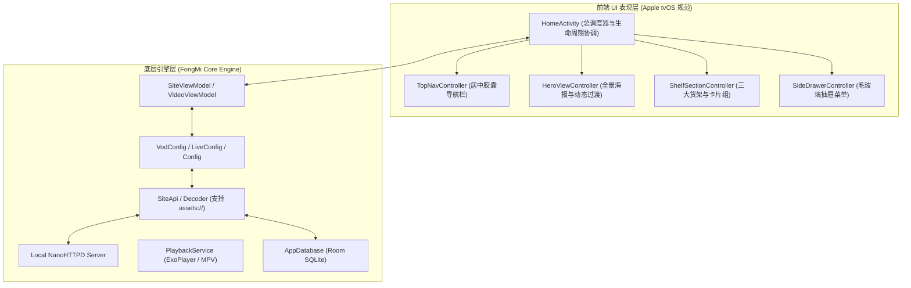

# Apple TVBox 项目工程交接与技术架构文档

> **版本**：`v1.0.41`  
> **基线 Commit**：`d669f7d`  
> **分支**：`main`  
> **最后构建状态**：GitHub Actions CI 构建通过 (Release `v1.0.41`)  
> **代码仓库**：[liujiawei-zuopin/apple-tvbox](https://github.com/liujiawei-zuopin/apple-tvbox)  
> **本地工作区**：`c:\Users\liuji\Documents\antigravity\sharp-brahmagupta\apple-tvbox`

---

## 一、 项目整体概述与核心架构

本项目基于 **FongMi（蜂蜜）TV 核心引擎** 进行深度重构，实现了 **“底层数据/播放引擎与前端 Apple tvOS 交互界面的 100% 彻底解耦”**。

---

## 二、 前端 UI 组件划分与核心文件清单

前端 UI 逻辑全部解耦至独立控制器中，避免了以往所有逻辑堆叠在单一 Activity 导致的“改一处坏全局”问题：

| 组件名称 | 对应 Java 控制器 / 布局文件 | 职责与设计规范 |
| :--- | :--- | :--- |
| **顶部胶囊导航** | `TopNavController.java` `bg_top_capsule_bar.xml` `bg_capsule_selected.xml` | • 完全屏幕水平居中。 • 纯白底黑字高亮胶囊（激活态），半透明白字（未激活态）。 • **彻底移除了左侧 Logo 与右侧时钟**。 |
| **Hero 全景海报** | `HeroViewController.java` `activity_home.xml` | • 全屏大图背景 + 80ms 防抖平滑淡入淡出（Cross-fade）。 • **海报区域纵向空间增大**，文本容器高度固定防抖动。 • **去除了标题（heroTitle）的所有投影阴影**，保持纯净排版。 |
| **三大货架与卡片** | `ShelfSectionController.java` `VodCardLandscapeAdapter.java` `VodCardPortraitAdapter.java` | • **现在观看 (Watch Now)**：16:9 横版卡片（`186dp × 105dp`，8dp 圆角）。 • **继续观看 (Continue Watching)**：带进度条与剩余时长标签。 • **正在热播 (Hot Picks)**：5 列 2:3 纵向海报卡片。 • **卡片焦点防抖**：采用标准 `RecyclerView`，解决卡片忽大忽小闪烁和跳回第 1 个的 Bug。 |
| **毛玻璃抽屉** | `SideDrawerController.java` `layout_side_drawer.xml` | • 左侧呼出式深色磨砂面板，按遥控器 [菜单键] 或向左滑出。 • 顶部展示时间时钟，包含搜索、历史、直播、配置、线路、网盘、收藏、推送八大入口。 |

---

## 三、 内置高保真离线演示测试源机制

为彻底摆脱外部服务器不稳定或第三方源失效对开发测试的干扰，工程内置了离线高保真演示数据源：

1. **内置资源文件**：
   - `app/src/main/assets/demo_config.json`：定义内置站点 `Apple TV+ 精选`，指定 `api: assets://demo_api.json`。
   - `app/src/main/assets/demo_api.json`：包含电影、剧集、动漫、纪录片四大分类，10+ 部精选影视（《沙丘 2》、《奥本海默》、《流人》、《基地》、《头脑特工队 2》、《蓦然回首》等），含高清封面、背景剧照、完整剧情和可直连播放的 4K/1080P 测试视频流。
2. **核心代码适配点**：
   - **自启动回退机制**（`Config.java` & `VodConfig.java`）：全新安装且无任何配置时，默认自动加载 `assets://demo_config.json`。
   - **`assets://` 协议解析**（`SiteApi.java`）：所有 `site.getApi()` 请求均通过 `UrlUtil.convert()` 映射至本地 NanoHTTPD 服务器，实现纯本地离线解析与流畅播放。
   - **用户自定义源兼容**：用户在「配置」中输入任意第三方源（如 `http://www.xn--sss604efuw.com/tv`）时，系统自动切换并持久化保存。

---

## 四、 本地自动化调试与测试工具链

工程已建立一套稳定可靠的自动化拉取、安装与 MuMu 模拟器回归测试工具链：

### 1. 常用测试脚本清单（位于根目录）

- **极速断点续传下载器**：`download_resilient.py`  
  *解决国内直连 GitHub 下载 113MB 安装包过慢和网络中断问题，支持 HTTP Range 续传与多重重试，约 9 秒完成下载。*
- **全自动回归测试脚本**：`run_test_v41_clean.py`  
  *自动卸载旧版 -> 安装新版 APK -> 启动应用 -> 执行 15 项 D-Pad 遥控器全链路按键 -> 抓取屏幕并保存至 `v41_screenshots/`。*
- **分类与抽屉专项测试**：`test_tabs_and_drawer.py`  
  *针对顶部分类切换与左侧菜单抽屉展开/关闭进行独立测试。*

### 2. 本地 ADB 环境配置

- **ADB 路径**：`D:\Program Files\Netease\MuMuPlayer\nx_device\15.0\shell\adb.exe`
- **模拟器端口**：`127.0.0.1:16384`
- **包名与入口**：`com.fongmi.android.tv/.ui.activity.HomeActivity`

---

## 五、 已解决的关键缺陷与技术沉淀

1. **卡片尺寸忽大忽小闪烁 & 遥控器向右移动时焦点跳回第 1 个**：
   - **根因**：Leanback 原生 `HorizontalGridView` 在 `NestedScrollView` 中会因为上方 Hero 区域文字更新触发 `requestLayout()` 重排，从而将焦点强制重置回内部 `mSelectedPosition = 0`。
   - **解决**：改用标准 `RecyclerView`（`LinearLayoutManager.HORIZONTAL`），并将放大动效绑定在内层 `CardView` 而非最外层 `itemView`，彻底解决跳焦与闪烁问题。
2. **下载与测试脚本长时间卡住**：
   - **根因**：网络握手阻塞 + Python 缓冲区未刷新。
   - **解决**：增加 HTTP Range 分块续传，加入 5-20 秒严格超时熔断机制与看门狗进程，遇到错误即刻抓屏输出。

---

## 六、 下一步新对话微调指引与建议项

当您开启新对话继续进行细节微调时，可直接参考以下模块定位：

1. **间距与卡片尺寸微调**：
   - 修改 `adapter_vod_card_landscape.xml` 与 `adapter_vod_card_portrait.xml` 中的宽高值与外边距。
2. **字体大小与颜色调优**：
   - 修改 `activity_home.xml` 中的 `heroTitle`、`heroBrief`、`heroDesc` 样式。
3. **顶栏分类与高亮色系微调**：
   - 修改 `bg_capsule_selected.xml` 与 `TopNavAdapter.java`。
4. **播放器界面及详情页（Detail / Playback）**：
   - 目前重构主要聚焦在 `HomeActivity` 与首页四大控制器，播放详情页仍保持原有逻辑，未来可在新对话中按 tvOS 风格继续重构 `DetailActivity` 与 `VideoActivity`。
